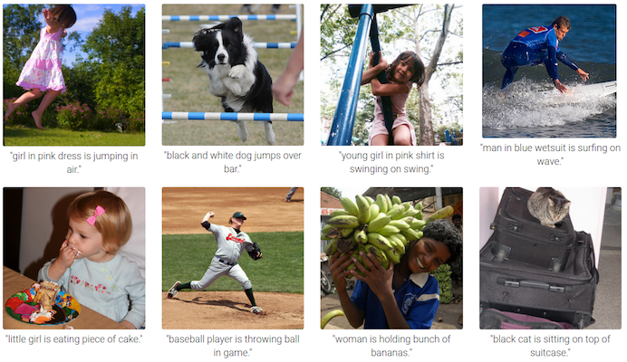
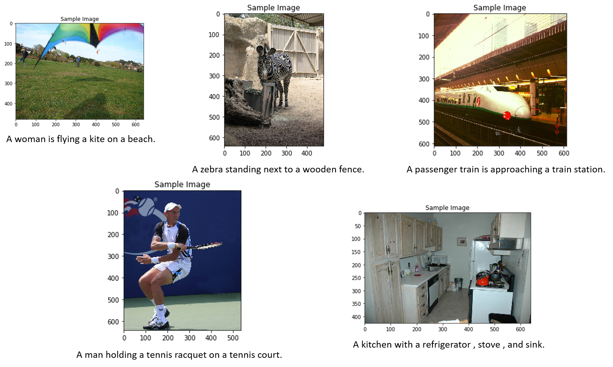

# Image Captioning Project

## Objective

In this project I utilize both CNNS and RNNS (LSTMs) for automatic image captioning.

## Getting the Files

### Data

The Microsoft **C**ommon **O**bjects in **CO**ntext (MS COCO) dataset is a large-scale dataset for scene understanding.  The dataset is commonly used to train and benchmark object detection, segmentation, and captioning algorithms.  

You can read more about the dataset on the [website](http://cocodataset.org/#home) or in the [research paper](https://arxiv.org/pdf/1405.0312.pdf).

To obtain and explore the dataset, you can use either the [COCO API](https://github.com/cocodataset/cocoapi), or run the [Dataset notebook](0_Dataset.ipynb).

### Model Download

The core architecture used to achieve this task follows an encoder-decoder architecture, where the encoder is a pretrained ResNet CNN on ImageNet, and the decoder is a basic one-layer LSTM.

Feel free to experiment with different architectures inclduing pre-trained models like VGG16, GoogleNet and RNNs models like GRU, LSTMs with different layers. 

## Result

Here are some results of images with associated captions:

## Dependencies

Before you can experiment with the code, you'll have to make sure that you have all the libraries and dependencies required to support this project. You will mainly need Python 3, PyTorch and its torchvision, OpenCV, Matplotlib. You can install many dependencies using `pip3 install -r requirements.txt`.

